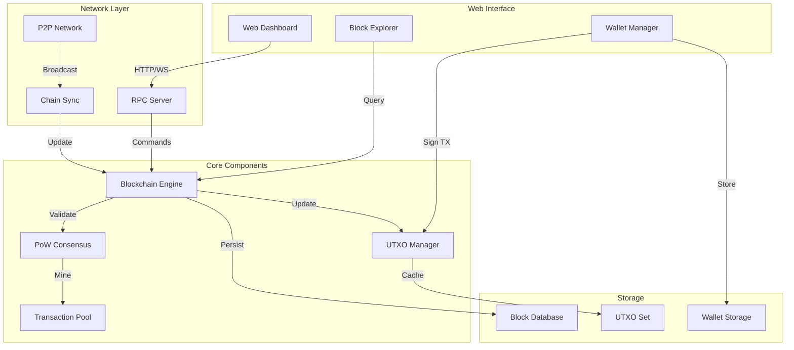

# 简化版比特币网络 (Simplied Bitcoin Network)

🚀 **基于 Go 语言的去中心化区块链网络实现**

[](https://go.dev/)
[](LICENSE)
[](https://bitcoin.org/)

## 📋 项目描述

这是一个使用 Go 语言实现的简化版比特币网络，涵盖了区块链技术的核心概念和机制。项目实现了完整的区块链数据结构、工作量证明（PoW）共识机制、UTXO 交易模型、P2P 网络通信、数字钱包等核心功能，并提供了直观的 Web 界面进行交互演示。

### 🎯 核心价值
- **完整的区块链实现**: 从创世区块到区块验证的完整区块链生命周期
- **真实的 PoW 共识**: 可调节难度的工作量证明挖矿机制
- **UTXO 交易模型**: 比特币核心的未花费交易输出模型
- **P2P 网络通信**: 去中心化的节点发现和数据同步
- **数字钱包系统**: 基于椭圆曲线加密的钱包地址生成和管理
- **Web 可视化界面**: 实时展示区块链状态和网络活动

## ⚙️ 技术栈

### 后端技术
- **Go 1.24+** - 高性能系统编程语言
- **Gorilla/Mux** - HTTP 路由和 Web 服务器
- **Gorilla/WebSocket** - 实时 WebSocket 通信
- **BoltDB** - 嵌入式键值数据库
- **crypto/ecdsa** - 椭圆曲线数字签名算法
- **encoding/gob** - Go 二进制序列化

### 前端技术
- **HTML5 + CSS3** - 现代化响应式界面
- **Vanilla JavaScript** - 零依赖前端实现
- **WebSocket API** - 实时数据推送
- **Chart.js** - 数据可视化图表
- **Web Crypto API** - 浏览器端加密操作

### 开发工具
- **Go Modules** - 依赖管理
- **Make** - 构建自动化
- **Docker** - 容器化部署
- **Delve** - Go 调试器

## 📊 系统架构图



## 🚀 功能特点

### ⛓️ 区块链核心
- **创世区块生成**: 自动创建区块链的第一个区块
- **区块结构**: 包含版本、时间戳、前块哈希、Merkle根等完整字段
- **链式验证**: 严格的区块链完整性和有效性验证
- **分叉处理**: 最长链原则的分叉解决机制
- **区块持久化**: 使用 BoltDB 进行高效的区块存储

### ⚡ 工作量证明（PoW）
- **SHA-256 哈希**: 双重 SHA-256 哈希算法
- **难度调整**: 基于出块时间的动态难度调整
- **Nonce 搜索**: 并发的工作量证明计算
- **目标值计算**: 精确的难度目标值转换
- **挖矿奖励**: Coinbase 交易和区块奖励机制

### 💰 UTXO 交易系统
- **UTXO 模型**: 完整的未花费交易输出追踪
- **交易验证**: 输入输出平衡和签名验证
- **脚本系统**: 简化的锁定/解锁脚本
- **双花防护**: UTXO 状态的原子性更新
- **交易费用**: 矿工费用计算和分配

### 🔐 数字钱包
- **密钥生成**: 基于 ECDSA 的公私钥对生成
- **地址编码**: Base58Check 编码的钱包地址
- **交易签名**: 数字签名的创建和验证
- **余额查询**: 实时的 UTXO 余额计算
- **多钱包管理**: 支持创建和管理多个钱包

### 🌐 P2P 网络
- **节点发现**: 种子节点和 DNS 种子
- **消息协议**: 自定义的二进制协议
- **区块传播**: 高效的区块和交易广播
- **链同步**: 增量和全量的区块链同步
- **节点管理**: 连接池和节点健康检查

### 📡 RPC 接口
- **RESTful API**: 标准的 HTTP JSON-RPC
- **WebSocket**: 实时事件推送
- **命令行工具**: CLI 客户端支持
- **批量请求**: 支持批量 RPC 调用
- **错误处理**: 标准化的错误响应

### 🎨 Web 界面
- **实时仪表盘**: 区块链状态和网络统计
- **区块浏览器**: 区块和交易详情查看
- **钱包界面**: 创建钱包和发送交易
- **挖矿控制**: 启动/停止挖矿操作
- **网络拓扑**: P2P 网络连接可视化

## 📁 项目目录结构

```
simplied-bitcoin-network-go/
├── cmd/
│   ├── node/
│   │   └── main.go              # 节点启动入口
│   ├── cli/
│   │   └── main.go              # 命令行工具
│   └── miner/
│       └── main.go              # 独立矿工程序
├── pkg/
│   ├── blockchain/
│   │   ├── block.go             # 区块结构定义
│   │   ├── blockchain.go        # 区块链管理
│   │   ├── genesis.go           # 创世区块
│   │   ├── validation.go        # 区块验证
│   │   └── merkle.go            # Merkle树实现
│   ├── consensus/
│   │   ├── pow.go               # 工作量证明
│   │   ├── difficulty.go        # 难度调整
│   │   └── miner.go             # 挖矿引擎
│   ├── transaction/
│   │   ├── transaction.go       # 交易结构
│   │   ├── utxo.go             # UTXO管理
│   │   ├── script.go           # 脚本系统
│   │   ├── mempool.go          # 交易池
│   │   └── coinbase.go         # Coinbase交易
│   ├── wallet/
│   │   ├── wallet.go            # 钱包实现
│   │   ├── keypair.go          # 密钥管理
│   │   ├── address.go          # 地址生成
│   │   └── signature.go        # 签名操作
│   ├── network/
│   │   ├── p2p.go              # P2P网络
│   │   ├── protocol.go         # 通信协议
│   │   ├── message.go          # 消息类型
│   │   ├── peer.go             # 节点管理
│   │   └── sync.go             # 链同步
│   ├── storage/
│   │   ├── database.go         # 数据库接口
│   │   ├── blockdb.go          # 区块存储
│   │   ├── utxodb.go           # UTXO存储
│   │   └── cache.go            # 缓存层
│   ├── rpc/
│   │   ├── server.go           # RPC服务器
│   │   ├── handlers.go         # API处理器
│   │   ├── websocket.go        # WebSocket
│   │   └── types.go            # 请求响应类型
│   └── utils/
│       ├── hash.go             # 哈希工具
│       ├── encoding.go         # 编码工具
│       ├── crypto.go           # 加密工具
│       └── config.go           # 配置管理
├── web/
│   ├── index.html              # 主页面
│   ├── js/
│   │   ├── app.js              # 主应用逻辑
│   │   ├── blockchain.js       # 区块链交互
│   │   ├── wallet.js           # 钱包管理
│   │   ├── charts.js           # 数据可视化
│   │   └── websocket.js        # 实时通信
│   ├── css/
│   │   ├── style.css           # 主样式
│   │   └── responsive.css      # 响应式样式
│   └── assets/
│       └── images/             # 图片资源
├── test/
│   ├── blockchain_test.go      # 区块链测试
│   ├── consensus_test.go       # 共识测试
│   ├── transaction_test.go     # 交易测试
│   ├── wallet_test.go          # 钱包测试
│   ├── network_test.go         # 网络测试
│   └── integration_test.go     # 集成测试
├── scripts/
│   ├── build.sh                # 构建脚本
│   ├── test.sh                 # 测试脚本
│   └── docker/
│       ├── Dockerfile          # Docker镜像
│       └── docker-compose.yml  # 多节点部署
├── config/
│   ├── config.yaml             # 默认配置
│   ├── genesis.json            # 创世区块配置
│   └── seeds.txt               # 种子节点列表
├── docs/
│   ├── API.md                  # API文档
│   ├── Protocol.md             # 协议规范
│   └── Architecture.md         # 架构设计
├── Makefile                    # 构建文件
├── go.mod                      # Go模块定义
├── go.sum                      # 依赖版本锁定
├── README.md                   # 项目说明
└── DEVELOPMENT.md              # 开发指南
```

## 🚀 快速开始

### 环境要求

- **Go 1.24+** - Go 编程语言
- **Make** - 构建工具
- **Git** - 版本控制
- **Docker** (可选) - 容器化部署

### 安装和运行

1. **克隆项目**
```bash
git clone https://github.com/yourusername/simplied-bitcoin-network-go.git
cd simplied-bitcoin-network-go
```

2. **安装依赖**
```bash
go mod download
```

3. **编译项目**
```bash
make build
# 或
go build -o bin/node cmd/node/main.go
```

4. **运行测试**
```bash
make test
# 或
go test ./... -v
```

5. **启动节点**
```bash
# 启动第一个节点（默认端口 8080）
./bin/node --port 8080 --rpc-port 8545

# 启动第二个节点（不同端口）
./bin/node --port 8081 --rpc-port 8546 --seed localhost:8080
```

6. **访问 Web 界面**
```bash
# 在浏览器中打开
http://localhost:8080
```

## 🛠️ 开发和构建

### 本地开发

```bash
# 编译所有组件
make build-all

# 运行所有测试
make test

# 运行基准测试
make bench

# 代码格式化
make fmt

# 代码检查
make lint

# 生成测试覆盖率
make coverage
```

### Docker 部署

```bash
# 构建 Docker 镜像
docker build -t bitcoin-network:latest .

# 运行单个节点
docker run -p 8080:8080 -p 8545:8545 bitcoin-network:latest

# 使用 docker-compose 运行多节点网络
docker-compose up -d

# 查看节点日志
docker-compose logs -f node1
```

### CLI 工具使用

```bash
# 查看区块链信息
./bin/cli getinfo

# 查看最新区块
./bin/cli getblock latest

# 创建新钱包
./bin/cli createwallet

# 查看钱包余额
./bin/cli getbalance <address>

# 发送交易
./bin/cli sendtransaction --from <address> --to <address> --amount 10

# 开始挖矿
./bin/cli startmining

# 停止挖矿
./bin/cli stopmining
```

## 📊 核心 API 接口

### RPC 接口

```go
// 区块链查询
GET /api/blocks              // 获取区块列表
GET /api/blocks/:hash        // 获取特定区块
GET /api/blockchain/info     // 获取区块链信息

// 交易操作
GET /api/transactions/:id    // 获取交易详情
POST /api/transactions       // 创建新交易
GET /api/mempool             // 获取内存池交易

// 钱包管理
POST /api/wallets            // 创建新钱包
GET /api/wallets/:address    // 获取钱包信息
GET /api/balance/:address    // 查询余额

// 挖矿控制
POST /api/mining/start       // 开始挖矿
POST /api/mining/stop        // 停止挖矿
GET /api/mining/status       // 挖矿状态

// 网络信息
GET /api/peers               // 获取连接节点
GET /api/network/stats       // 网络统计信息
```

### WebSocket 事件

```javascript
// 订阅新区块
ws.send(JSON.stringify({
    type: "subscribe",
    channel: "blocks"
}));

// 订阅新交易
ws.send(JSON.stringify({
    type: "subscribe",
    channel: "transactions"
}));

// 接收事件
ws.onmessage = (event) => {
    const data = JSON.parse(event.data);
    switch(data.type) {
        case "new_block":
            // 处理新区块
            break;
        case "new_transaction":
            // 处理新交易
            break;
    }
};
```

## 📈 性能指标

### 基准测试结果
- **区块生成时间**: ~10 秒（可调节）
- **交易验证速度**: >5000 TPS
- **区块验证速度**: <100ms
- **UTXO 查询时间**: <10ms
- **P2P 同步速度**: >1000 blocks/s

### 资源占用
- **内存使用**: <500MB（10万区块）
- **磁盘空间**: ~1GB（10万区块）
- **CPU 使用**: 单核 ~30%（挖矿时 100%）
- **网络带宽**: <100KB/s（正常运行）

## 🔒 安全特性

### 密码学安全
- **ECDSA 签名**: secp256k1 椭圆曲线
- **SHA-256 哈希**: 双重哈希保护
- **密钥安全**: 私钥本地加密存储
- **地址校验**: Base58Check 防错机制

### 网络安全
- **消息认证**: 数字签名验证
- **防 DDoS**: 连接限制和速率控制
- **防双花**: UTXO 锁定机制
- **防重放**: 交易 Nonce 机制

## 🌟 项目亮点

### 技术实现
- **高并发设计**: 充分利用 Go 的 goroutine 和 channel
- **模块化架构**: 清晰的分层设计和接口定义
- **内存优化**: 高效的数据结构和缓存策略
- **代码质量**: 完整的测试覆盖和文档注释

### 学习价值
- **区块链原理**: 深入理解区块链核心概念
- **分布式系统**: P2P 网络和共识机制实践
- **密码学应用**: 数字签名和哈希算法使用
- **Go 语言实践**: 并发编程和系统设计

### 可扩展性
- **插件化共识**: 易于替换不同共识算法
- **模块化存储**: 支持不同存储后端
- **灵活的网络层**: 可扩展的消息协议
- **丰富的 API**: 完整的编程接口

## 🤝 贡献指南

1. Fork 项目
2. 创建功能分支 (`git checkout -b feature/new-feature`)
3. 提交更改 (`git commit -m 'feat: add new feature'`)
4. 推送到分支 (`git push origin feature/new-feature`)
5. 创建 Pull Request

### 代码规范
- 遵循 Go 官方编码规范
- 使用 `gofmt` 格式化代码
- 编写完整的单元测试
- 添加必要的注释文档

## 📝 许可证

本项目采用 MIT 许可证 - 查看 [LICENSE](LICENSE) 文件了解详情。

---

## 🎯 演示和资源

- **🌐 在线演示**: https://yourusername.github.io/bitcoin-network-demo/
- **📹 视频教程**: https://youtube.com/watch?v=demo
- **📚 技术博客**: https://blog.example.com/bitcoin-network-go

---

⭐ 如果这个项目对你有帮助，请给一个 Star！这个项目完美展示了使用 Go 语言实现区块链系统的能力，是理解比特币网络原理的绝佳学习资源。